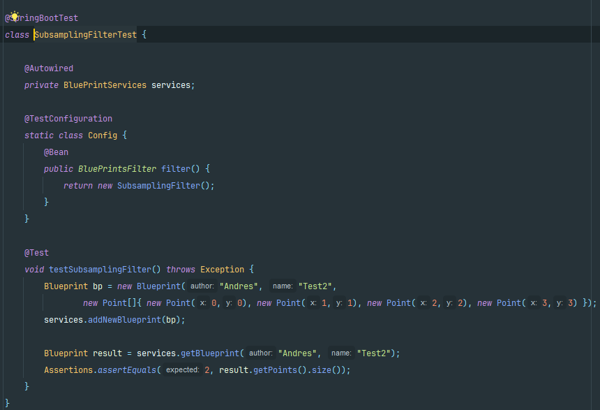

## Escuela Colombiana de Ingeniería

## Arquitecturas de Software

### Autor: Andrés Jacobo Sepúlveda Sánchez

# Componentes y conectores - Parte I.

El ejercicio se debe traer terminado para el siguiente laboratorio (Parte II).

#### Middleware- gestión de planos.


## Antes de hacer este ejercicio, realice [el ejercicio introductorio al manejo de Spring y la configuración basada en anotaciones](https://github.com/ARSW-ECI/Spring_LightweightCont_Annotation-DI_Example).

En este ejercicio se va a construír un modelo de clases para la capa lógica de una aplicación que permita gestionar planos arquitectónicos de una prestigiosa compañia de diseño. 


1. Configure la aplicación para que funcione bajo un esquema de inyección de dependencias, tal como se muestra en el diagrama anterior.


	Lo anterior requiere:

	* Agregar las dependencias de Spring.
	* Agregar la configuración de Spring.
	* Configurar la aplicación -mediante anotaciones- para que el esquema de persistencia sea inyectado al momento de ser creado el bean 'BlueprintServices'.

Las dependencias y configuraciones se agregaron en base a lo que estaba en el central repository de maven:

**Dependencias:**


**Configuraciones:**


**Definimos interfaz BluePrintPersistence:**


2. Complete los operaciones getBluePrint() y getBlueprintsByAuthor(). Implemente todo lo requerido de las capas inferiores (por ahora, el esquema de persistencia disponible 'InMemoryBlueprintPersistence') agregando las pruebas correspondientes en 'InMemoryPersistenceTest'.

**Implementamos primero los métodos en la clase service:**


**Luego hacemos lo mismo en la clase de Persistence:**


**Para verificar que todo está bien escribimos pruebas unitarias:**


3. Haga un programa en el que cree (mediante Spring) una instancia de BlueprintServices, y rectifique la funcionalidad del mismo: registrar planos, consultar planos, registrar planos específicos, etc.

**Para ello agregamos la notación @Service en la clase BluePrintServices:**


4. Se quiere que las operaciones de consulta de planos realicen un proceso de filtrado, antes de retornar los planos consultados. Dichos filtros lo que buscan es reducir el tamaño de los planos, removiendo datos redundantes o simplemente submuestrando, antes de retornarlos. Ajuste la aplicación (agregando las abstracciones e implementaciones que considere) para que a la clase BlueprintServices se le inyecte uno de dos posibles 'filtros' (o eventuales futuros filtros). No se contempla el uso de más de uno a la vez:
	
	**Para ello primero creamos la interfaz BluePrintsFilter de la cual implementaran los filtros:**

   
	
    * (A) Filtrado de redundancias: suprime del plano los puntos consecutivos que sean repetidos.
   
	**Para ello creamos la clase RedundancyFilter la cual implementa la interfaz antes mencionada:**

   

	* (B) Filtrado de submuestreo: suprime 1 de cada 2 puntos del plano, de manera intercalada.
   
    **Similar a (A) creamos la clase SubsamplingFilter:**

   
    
    **Luego en la clase Service añadimos el Autowired y modificamos los métodos para que apliquen los filtros a cada plano:**

   
    
    ```java
   getBlueprintsByAuthor()
    ```
   
    
    ```java
   getBlueprint()
   getAllBlueprints()
    ```    

   

    **Por ultímo dado que hay dos filtros con ayuda de @primary especificamos que por defecto se usara un filtro a menos que se especifique lo contrario:**

   

5. Agrege las pruebas correspondientes a cada uno de estos filtros, y pruebe su funcionamiento en el programa de prueba, comprobando que sólo cambiando la posición de las anotaciones -sin cambiar nada más-, el programa retorne los planos filtrados de la manera (A) o de la manera (B). 

**Para terminar generamos una clase de prueba por filtro (2 en total) y para que no existan problemas al momento de correrlas en el testConfig definimos que filtro se usara ademas de quitar el @primary** 

**RedundancyFilterTest**


**SubsamplingFilterTest**



**Evidencias de que todas las pruebas pasan:**

```InMemoryPersistenceTest```


```RedundancyFilterTest```


```SubsamplingFilterTest```


